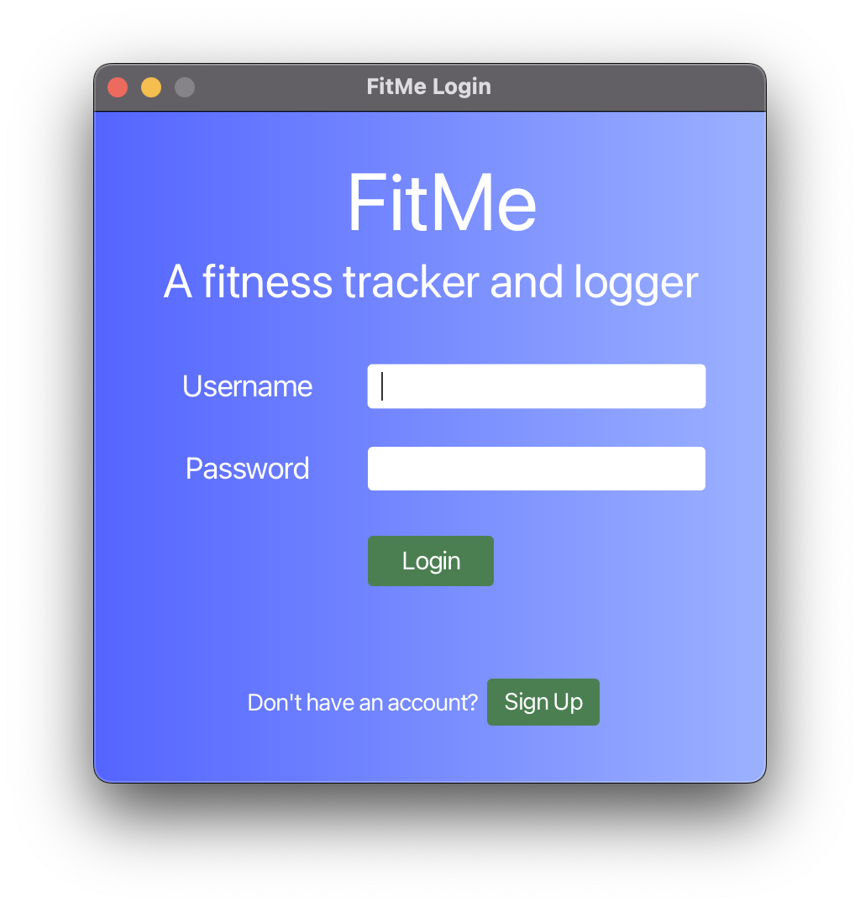
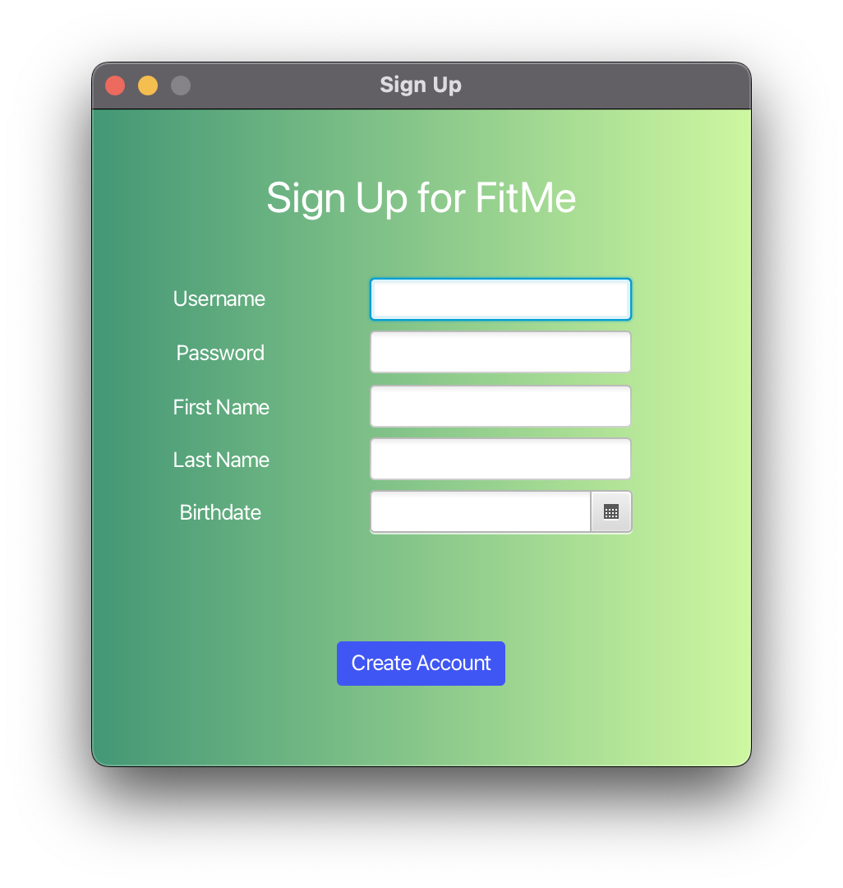
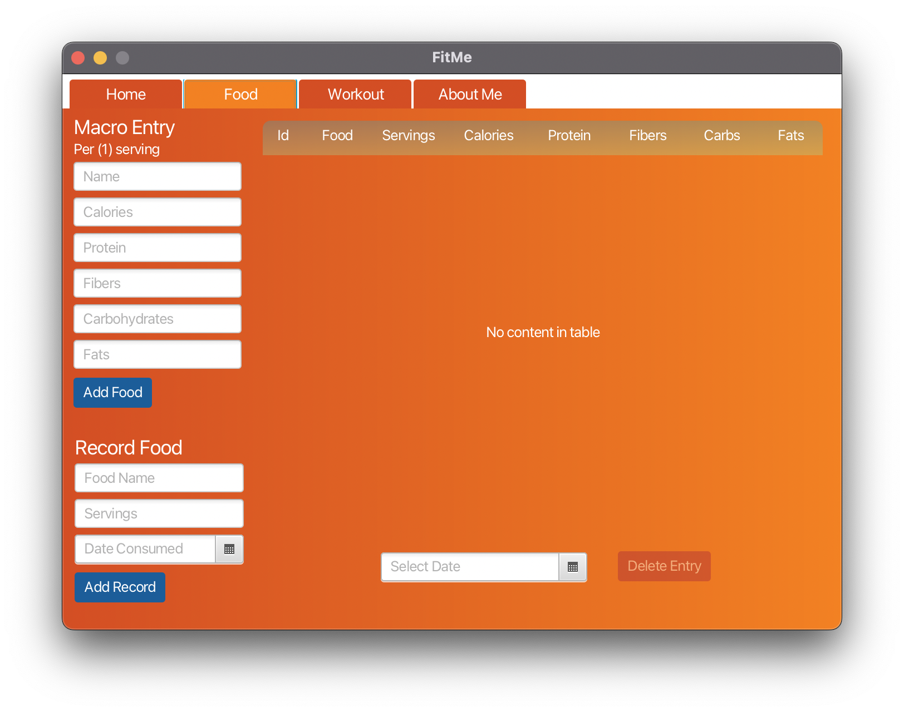
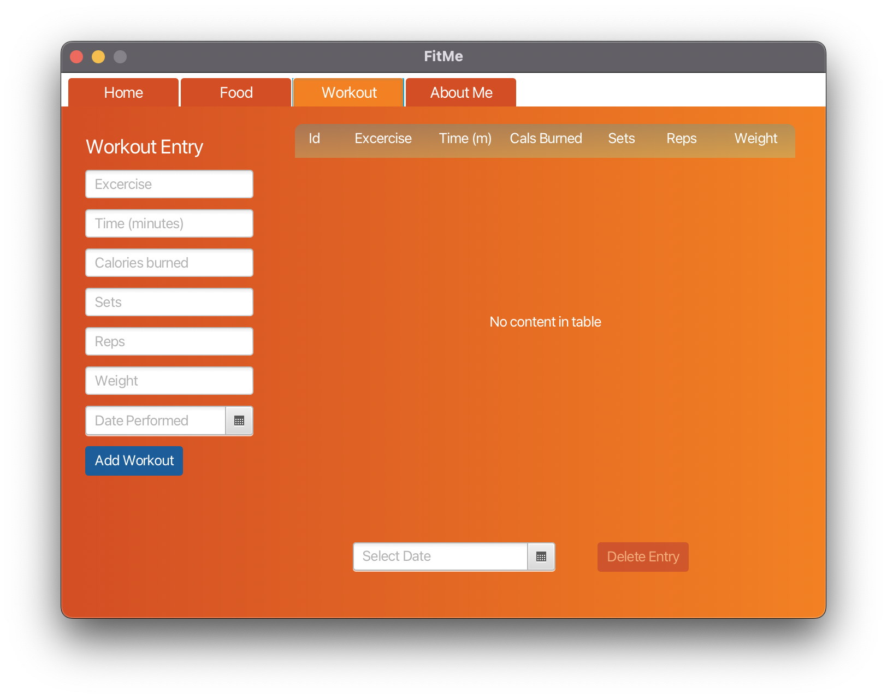

# FitMe

*A Fitness Journey Tracker*

## Installation
There will be a jar file soon kekw

## Usage

The login page is what greets the user upon start of the program. The user can either login or sign up for an account.

Without an account, begin by signing up for one. Below are the necessary fields to create a user on the local database. FitMe will not allow for duplicate accounts contingent on the username.

The food tab on the dashboard allows for logging of specific foods and macros in accordance with singular servings. Users can then add the food based on particular servings on specific dates.

The workout tab on the dashboard allows users to log excercises and track some of the seen statistics. Only the excercise, calories, and date performed are necessary fields. 

## Technology Used
- JavaFX
- Sqlite3
- FXML (Scene Builder)
- CSS